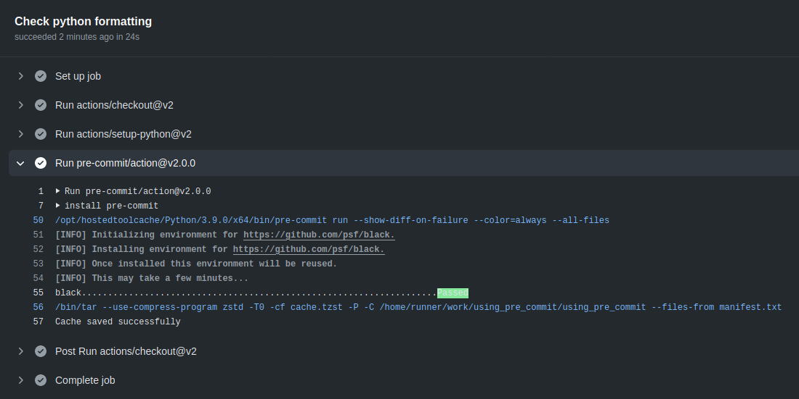

This repo is mainly for my own reference in using pre-commit to perform linting checks.  

General information about what git hooks are and do: https://git-scm.com/book/en/v2/Customizing-Git-Git-Hooks  
Info about setting up pre-commit: https://pre-commit.com/ - most of the steps here are just following the instructions there.

## Client side checking
I.e. check your local changes when you run `git commit ...` command

### Install pre-commit python package
I will do this in a virtual environment
```shell script
python3 -m venv pc_venv
source pc_venv/bin/activate
pip install pre-commit
```

### Define a hook using a yaml file
```yaml
repos:
  -   repo: https://github.com/psf/black
      rev: 19.3b0
      hooks:
        -   id: black
```
The file `pre-commit-config.yaml` for formatting python code using [black](https://pypi.org/project/black/).  

Actually we don't really define the hook (what to run) here, we just refer to some pre-existing hook definition, specifically the one with the id `black` in the `.pre-commit-hooks.yaml` file in the referenced repository.  

A `pyproject.toml` file is included that includes some configuration for black.

### Use pre-commit to set up the hooks
```shell script
source pc_venv/bin/activate
pre-commit install
pre-commit run --all-files
```
This will modify the python file with any required formatting changes.

### Test the pre-commit action
Make some questionable changes to the python file  
Try to commit it  
```shell script
git add scripts/format_me.py
git commit -m "Try to add bad formatting"
```
Assuming the changes aren't consistent with the black formatting rules, the pre-commit action (which runs the black linter) will abort the commit.  
The linter did make the necessary changes though, so we can just run the previous commands again. 
```shell script
git add scripts/format_me.py
git commit -m "Try to add bad formatting" # though now our bad changes have been automatically fixed
```

## Server side checking
This isn't quite server-side checking in the sense describe by the pre-commit package, but we'll achieve a similar result using Github actions.  

Add a workflow file in `.github/workflows`, basically following the instructions here: https://github.com/pre-commit/action  
And black now gets run upon push to github  



## More checks
Further checks can be added by adding more hooks to `pre-commit-config.yaml`. These will now be run automatically when commiting locally and by the github action that we added.  


